# The Quantum Diamond AI Application Development Framework
**Version:** 3.0

## Overview
Traditional development models are breaking under the creative and technical pressures of the AI age. Teams are caught in a false dichotomy: move fast with inspired "vibe coding" and risk building brittle, unmaintainable systems, or move slowly with rigorous "architecture-first" discipline and risk engineering the wrong solution perfectly.

**The Quantum Diamond Framework is the synthesis that resolves this conflict.**

It is a next-generation workflow designed for a world of collaborative AI. It honors the lineage of the best human-centric and engineering practices, fusing them into a single, coherent whole:

It takes the empathetic, problem-finding power of **Service Design** and **Triple Diamond Design**.

It supercharges discovery and validation with AI-powered **"Vibe Coding"**—not as a reckless shortcut, but as a sanctioned, high-speed prototyping tool.

It channels the resulting validated vision into the unyielding discipline of 

**Architecture-First Development** and the rigorous safety net of **Test-Driven Design**.
The result is a framework that allows teams to be both radically creative and impeccably engineered. It provides a shared language for designers, architects, and product leaders to navigate the quantum possibilities of AI, collapsing them into classical, reliable, and valuable software.

This repository contains the complete methodology for building the next generation of AI-native applications.

---
## Project: [Name of the AI-Native Feature]
**Date:** [Date]
**Human Lead (Product/Design):** [Name]
**Human Lead (Architecture/Eng):** [Name]
---

## Core Principles: Human Intent, AI Velocity, Engineering Rigor

This workflow fuses human strategic insight with the generative power of AI agents, all grounded in the discipline of production-grade engineering.

1.  **Human-Led Vision:** The human is the strategist, the empath, the curator, and the final decision-maker.
2.  **AI-Powered Velocity:** We treat AI not as a tool, but as a team of tireless, expert agents to accelerate discovery and prototyping.
3.  **Disciplined Engineering:** Creativity is channeled into structure. A validated vision is translated into a reliable, secure, and maintainable system.

## The Two Cycles of the Quantum Diamond Framework

The workflow consists of two distinct cycles. The first is a fluid, creative loop for envisioning the right solution. The second is a structured, predictable path to build that solution right.

`[ 🌀 The Genesis Cycle: Envision the Right Thing ] -> [ ⚙️ The Engineering Cycle: Build the Thing Right ]`

### The Quantum Diamond Workflow Diagram

```mermaid
---
title: The Quantum Diamond Framework (v3.0)
---
graph TD
    subgraph "Phase I: 🌀 The Genesis Cycle (Human-AI Collaboration)"
        direction LR
        A[Human Intent<br/><i>'I have a goal...'</i>]
        B{AI Agent<br/>Service Designer}
        C{AI Agent<br/>App Prototyper}
        D[Human Synthesis<br/>& Validation]

        A -- Asks 'Why?' & 'For whom?' --> B
        B -- Generates Personas,<br/>Journeys, 'HMWs' --> A
        A -- Describes a solution --> C
        C -- Generates UI &<br/>Code Prototypes --> A
        A -- Curates & Refines Outputs --> D
        D -- Tests with Stakeholders --> A
    end
    
    subgraph " "
        direction LR
        ValidatedVision([Validated Vision Prototype])
        D -- Produces --> ValidatedVision
    end

    subgraph "Phase II: ⚙️ The Engineering Cycle (Architecture-First Execution)"
        S0[<b>Stage 0: Strategy</b>]
        S1[<b>Stage 1: Scaffolding</b>]
        S2[<b>Stage 2: Implementation</b>]
        S3[<b>Stage 3: Validation</b>]
        S4[<b>Stage 4: Deployment</b>]
        S5[<b>Stage 5: Monitoring</b>]
        
        S0 --> S1
        S1 --> S2
        S2 --> S3
        S3 --> S4
        S4 --> S5
    end

    ValidatedVision -- Is the input for --> S0
    S5 -.-> |New Insights & Opportunities| A

    %% Styling
    style B fill:#d4e4ff,stroke:#333,stroke-width:2px,stroke-dasharray: 5 5
    style C fill:#d4e4ff,stroke:#333,stroke-width:2px,stroke-dasharray: 5 5
```

---
## Phase I: 🌀 The Genesis Cycle (Envision the Right Thing)

**Goal:** To explore a quantum wave of possibilities and collapse it into a single, validated vision. This phase is a dynamic, creative conversation between a human lead and their AI agents, prioritizing exploration and learning over structure.

The specific techniques, prompts, and agent interactions for this phase are detailed in its dedicated playbook.

mew➡️ **For a detailed guide, see the [Playbook: The Genesis Cycle](./01_playbook-genesis-cycle.md).**

---
## Phase II: ⚙️ The Engineering Cycle (Build the Thing Right)

**Goal:** To take the validated vision—the collapsed reality—and build it right. This phase is about disciplined, deterministic execution where architectural rigor, types, tests, and schemas are paramount.

This is the direct implementation of the architecture-first development process.

➡️ **For a detailed, step-by-step guide, see the [Playbook: The Engineering Cycle](./02_Playbook_EngineeringCycle.md).**

---
## Repository Structure

The **Quantum Diamond Framework** is defined across the following documents:

*   **`README.md`**: (This file) The high-level overview of the entire process.
*   **`01_Playbook_GenesisCycle.md`**: A tactical guide for product managers and designers on running the creative, human-AI collaborative cycle.
*   **`02_Playbook_EngineeringCycle.md`**: A tactical guide for architects and engineers on building, testing, and deploying the AI feature with rigor.

