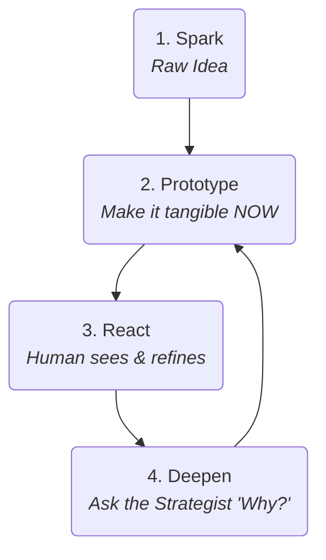

# Playbook: The Genesis Cycle
**Version:** 3.2
**Subtitle:** The Jam Session
**Part of:** The Quantum Diamond Framework

This playbook guides the first phase of the **Quantum Diamond Framework**. Its goal is to reject rigid, upfront planning and instead foster a rapid, iterative loop of co-creation. This is a conversation where tangible prototypes drive strategic discovery. We **add rigor as clarity emerges, not before.**

## The Actors

*   **Human Lead (Designer/PM):** The band leader. You provide the initial riff (the idea), listen to what the AI plays back, and guide the session toward a coherent song.
*   **AI App Prototyper Agent:** Your lead guitarist. Instantly makes ideas audible and tangible (e.g., `bolt.new`, v0.dev, Copilot in a scratchpad). Its job is to generate UI and code at the speed of thought.
*   **AI Product Strategist Agent:** Your producer/coach. Listens to the prototype and helps you think critically about it (e.g., GPT-4, Claude). Crucially, it captures the emerging strategy, turning the ad-hoc decisions of the jam session into structured artifacts (personas, requirements, contracts) behind the scenes.

## The Process: The Prototyping Loop

Instead of a linear sequence, the Genesis Cycle is a fluid loop you can enter at any point. The core principle is: **Make it real first, then make it right.** The structured artifacts of service design (personas, user stories, etc.) are not prerequisites for this loop; they are **outputs** of it.

### The Loop in Action: An Example Flow

**1. Spark:** The Human Lead has a vague idea.
*   **Human Input:** "I'm tired of digging through support emails. I wish I could just paste one in and see what's wrong."

**2. Prototype:** Go straight to the **AI App Prototyper**. No committee meetings. Just build.
*   **Human Prompt to Prototyper:** "Create a simple web page titled 'Support Ticket Analyzer'. It needs a big text area and a button that says 'Analyze'."

**3. React:** The Human sees the tangible UI and the idea becomes clearer. The prototype is a question, not an answer.
*   **Human Input:** "Okay, that's a start. Now, when I click 'Analyze', I need to see a summary, an urgency level, and a suggested category like 'Billing' or 'Technical'."
*   **Human Prompt to Prototyper:** "Write a Python function using `instructor` that takes text and extracts a Pydantic model with fields for `summary: str`, `is_urgent: bool`, and `category: str`."

**4. Deepen:** Now that there's a *thing* to react to, engage the **AI Product Strategist** in parallel.
*   **Human Prompt to Strategist:** "Looking at this prototype, the primary user is a Tier 1 support agent. Generate a quick 'proto-persona' for 'Dave,' who's overworked and needs to triage 100 tickets a day. Based on the prototype's function, what would be most important to him?"
*   **AI Strategist Output:** "Persona: Dave, Support Agent. Goal: Close tickets fast. Frustration: Wasting time on non-urgent tickets. Key Insight: For Dave, the `is_urgent` flag is everything. He needs to see it instantly."

---
#### **What's Happening in Parallel: Emergent Rigor**
This is the key to the Genesis Cycle. While the Human Lead is focused on the creative flow, the system is progressively elaborating and documenting the design decisions, transparently building the foundation for the Engineering Cycle.

*   The **Prototyper**'s Python function has already defined a `v0.1` data contract (the Pydantic model for `TicketAnalysis`).
*   The **Strategist**'s output is the first draft of a user persona and a key user requirement ("Urgency must be obvious").

This isn't a separate, bureaucratic step; it's the system capturing the creative decisions as they are made, adding structure organically.
---

**(Back to Step 2/3) Iterate & Refine:** The strategic insight immediately feeds back into the prototype, adding another layer of detail.
*   **Human Prompt to Prototyper:** "Great insight. Let's change the UI. If `is_urgent` is true, display the summary in a big, red, flashing box. Also, refine the logic prompt to be more sensitive to keywords like 'outage,' 'down,' or 'cannot log in'."

This loop continues, with each cycle making the prototype more functional and the underlying strategy more explicit and rigorous, until the solution is compelling and solves a clear, well-understood problem.

## Definition of Done

The Genesis Cycle is complete when the loop has produced:
*   ✅ A **Validated Vision Prototype** that has received positive feedback from key stakeholders.
*   ✅ An **Initial AI Component Contract** that has emerged organically from the final prototype's inputs and outputs.