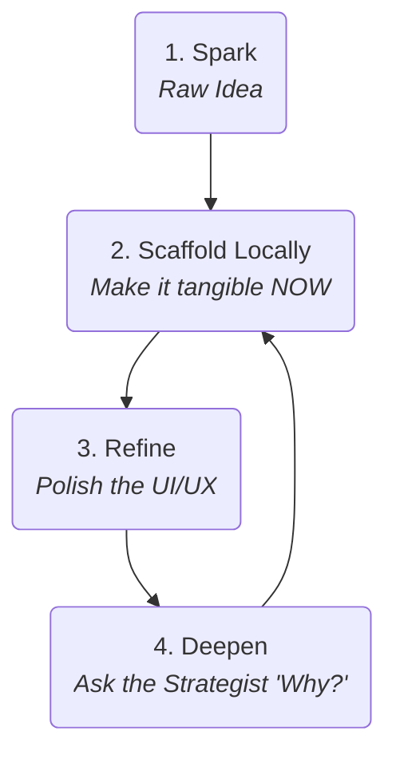

# Playbook: The Genesis Cycle
**Version:** 4.2
**Subtitle:** The Local-First Jam Session
**Part of:** The Quantum Diamond Framework

This playbook guides the first phase of the **Quantum Diamond Framework**. Its central philosophy is **local-first prototyping**: using lightweight, zero-cost local tools to rapidly iterate in a "jam session" where tangible artifacts drive strategic discovery.

## The Local-First Principle

The Genesis Cycle is for exploration and validation. We must eliminate all friction—including cloud setup, account creation, and cost. By default, we use a file-based **SQLite** database managed by **Prisma** and a simple **Express** server. This allows for instant startup and iteration while still producing professional, versioned schema migrations—the core of "emergent rigor." The prototype is "graduated" to a production database like Supabase/PostgreSQL only when we enter the formal Engineering Cycle.

## The Actors: A Specialist Team

*   **Human Lead (The Director):** The product visionary.
*   **AI Full-Stack Scaffolder:** Your infrastructure expert. In this cycle, it specializes in setting up local Vite, Express, Prisma, and SQLite stacks.
*   **AI UI/UX Specialist:** Your frontend expert, focused on creating beautiful, component-driven UIs and design systems.
*   **AI Product Strategist:** Your Socratic partner for asking "why" and ensuring the prototype aligns with user needs.

## The Process: The Prototyping Loop

### The Loop in Action: An Example Flow

**1. Spark:** "I want to build an exercise tracking app."

**2. Scaffold Locally:** The Human Lead engages the **AI Full-Stack Scaffolder**.
*   **Human Prompt to Scaffolder:** "Let's start a local-first exercise tracking app. Scaffold a Vite+React project. Set up a simple Express server and use Prisma to manage a local SQLite database. Create the initial Prisma schema for `workouts` and `exercises`, then generate the first migration."

**What Emerges: A Professional Local Foundation**
The scaffolder produces a complete, runnable local project. The "emergent rigor" artifacts are now local-first.

*   **Artifact Example (`/prisma/schema.prisma`):** A clean, declarative schema.
*   **Artifact Example (`/prisma/migrations/..._init.sql`):** A versioned SQL file generated by Prisma.
*   **Artifact Example (`/server/index.js`):** A simple Express server with a mock API endpoint.
*   **Artifact Example (`/src/pages/Index.tsx`):** A React UI that fetches from the local API.

The Human Lead can `npm install`, run the server, run the client, and see a working prototype in minutes with zero external dependencies.

