# Playbook: The Engineering Cycle
**Version:** v17
**Part of:** The Quantum Diamond Framework

## The Core Principle: Engineer the Reality

The Genesis Cycle explores the quantum realm of possibilities. It's creative, chaotic, and divergent. This Engineering Cycle is where we collapse that possibility into a single, classical, deterministic reality. **The fundamental goal of this playbook is to eliminate improvisation from the production path.**

Where the Genesis Cycle is a fluid jam session, this cycle is the sheet music. We are not exploring; we are building. This is the factory blueprint, designed for predictability, reliability, and rigor.

### The Engineering Cycle at a Glance

```mermaid
graph TD
    GC[<b>🌀 Genesis Cycle</b><br/><i>Creative Phase</i>] --> S0

    subgraph Pre-Production
        S0[<b>Stage 0: Strategy</b><br/><i>Artifact: ADRs, Formal Contract</i>] --> S1
        S1[<b>Stage 1: Scaffolding & Types</b><br/><i>Artifact: Project Structure, Schemas</i>] --> S2
        S2[<b>Stage 2: Implementation</b><br/><i>Artifact: Production Code, Versioned Prompts</i>] --> S3
        S3{<b>Stage 3: Validation</b><br/><i>Does it pass all tests?</i>}
    end

    subgraph Production
        S4[<b>Stage 4: Deployment</b><br/><i>Artifact: Deployed Container</i>] --> S5
        S5[<b>Stage 5: Monitoring</b><br/><i>Artifact: Dashboards, Alerts</i>]
    end

    S3 -- Yes --> S4
    S3 -- No --> S2

    S5 -.-> |Major Revision Needed| GC
    S5 -.-> |Minor Prompt/Logic Tweak| S2
```

---
## The Handoff

The input to this cycle is the **Validated Vision Prototype** and its associated **Initial Engineering Artifacts**, which can come from either a rapid prototyping canvas or a guided IDE session.

---
### Stage 0: Strategy & System Design (The Blueprint)

**1. Graduate the Prototype to Production Infrastructure:** If the prototype was built with a local-first or rapid-development stack, the first step is to migrate it to a production-ready stack.
    *   **Database Migration:** Convert the schema (e.g., from SQLite/Prisma) to its production equivalent (e.g., PostgreSQL for Supabase).
    *   **Security Hardening:** Implement robust Row Level Security (RLS) policies and authentication.
    *   **Backend Refactoring:** Replace any simple local servers with scalable infrastructure (e.g., serverless functions).

**2. Formalize the AI Component Contract:** Convert any implicit data structures into version-controlled Pydantic/Zod schemas.

**3. Author Architecture Decision Records (ADRs):** Document the *why* behind key technical choices.

---
### Stage 1: Scaffolding & Contracts (The Connective Tissue)
1.  **Establish the Standardized Project Structure.**
2.  **Define Data Contracts as the System's Connective Tissue (Types):** Define schemas once and reuse them everywhere.

---
### Stage 2: Implementation (The AI Core)
1.  **Rewrite Prototype Logic as Production Code.** The prototype was for learning; this is for scale and reliability.
2.  **Use Schema-Driven Libraries** like `instructor` to bind LLM calls directly to schemas.
3.  **Externalize Prompts** into a versioned `prompts/` directory.

---
### Stage 3: Behavioral Validation (The Safety Net)
Build an automated "wall of tests" in CI: Correctness, Guardrail, Robustness, and Schema Adherence tests.

---
### Stage 4: Deployment & Delivery (CD)
1.  **Containerize** the service (e.g., Docker).
2.  **Automate Deployment** via a CI/CD pipeline.
3.  **Deploy Safely** using Canary or Shadow deployments.

---
### Stage 5: Monitoring & Refinement
1.  **System Health:** Monitor standard app metrics (latency, errors, CPU).
2.  **AI Component Health:** Monitor **cost**, **latency**, and **validation failure rate**.
3.  **The Feedback Loop:** Insights from monitoring are the primary input for the next **Genesis Cycle**.