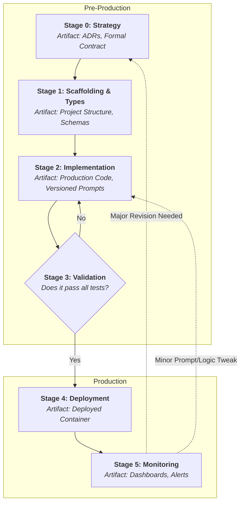

# Playbook: The Engineering Cycle
**Version:** 3.0
**Part of:** The Quantum Diamond Framework

## The Core Principle: Engineer the Reality

The Genesis Cycle explores the quantum realm of possibilities. It's creative, chaotic, and divergent. This Engineering Cycle is where we collapse that possibility into a single, classical, deterministic reality. **The fundamental goal of this playbook is to eliminate improvisation from the production path.** We are not exploring; we are building. This is the factory blueprint.

### The Engineering Cycle at a Glance

---
## The Handoff

The input to this cycle is the **Validated Vision Prototype** and **Initial AI Component Contract** from the Genesis Cycle.

---
### Stage 0: Strategy & System Design (The Blueprint)
1.  **Formalize the AI Component Contract:** Convert the initial contract into a version-controlled Pydantic/Zod schema and a detailed markdown document with inputs, outputs, and all constraints (Performance, Cost, Safety, Business Logic).
2.  **Author Architecture Decision Records (ADRs):** Document the *why* behind key technical choices.

---
### Stage 1: Scaffolding & Contracts (The Connective Tissue)
1.  **Establish the Standardized Project Structure.**
2.  **Define Data Contracts as the System's Connective Tissue (Types):** Define schemas once and reuse them everywhere: AI Outputs, API Endpoints, and Database Models. This is the essence of contract-first design.

---
### Stage 2: Implementation (The AI Core)
1.  **Rewrite Prototype Logic as Production Code.**
2.  **Use Schema-Driven Libraries:** Use tools like `instructor` to bind the LLM call directly to your Pydantic schemas, enforcing your contract at runtime.
3.  **Externalize Prompts:** Store prompts in a `prompts/` directory, treating them as versioned configuration.

---
### Stage 3: Behavioral Validation (The Safety Net)
Build an automated "wall of tests" in CI. The change is not ready to merge until they pass.
1.  **Correctness Tests:** Does it get the right answer on golden-path inputs?
2.  **Guardrail Tests:** Does it obey negative constraints (e.g., PII, safety)?
3.  **Robustness Tests:** How does it handle garbage, empty, or adversarial inputs?
4.  **Schema Adherence Tests:** Mock a malformed JSON response. Does the app handle it gracefully?

---
### Stage 4: Deployment & Delivery (CD)
1.  **Containerize:** Package the service into a reproducible Docker container.
2.  **Automate Deployment:** Create a CI/CD pipeline that runs all tests, builds, and pushes.
3.  **Deploy Safely:** Use Shadow Deployment or Canary Releases to minimize risk.

---
### Stage 5: Monitoring & Refinement
1.  **System Health:** Monitor standard app metrics (latency, errors, CPU).
2.  **AI Component Health ("Golden Signals" of AIOps):** Monitor **cost**, **latency**, and **validation failure rate**.
3.  **Output Drift:** Monitor the statistical properties of the AI's output.
4.  **The Feedback Loop:** Insights from monitoring are the primary input for the next **Genesis Cycle**.