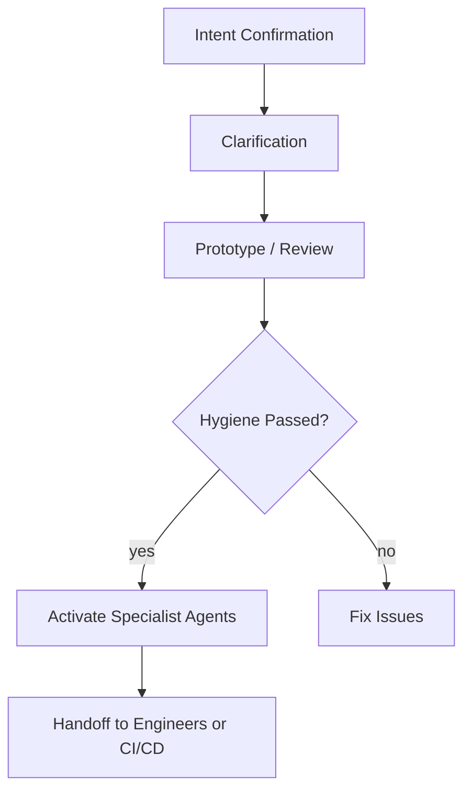

# Quantum Diamond Framework Prompts

This directory contains all the specialized AI prompts that power the Quantum Diamond Framework. Each prompt is designed for a specific role in the development workflow, ensuring comprehensive coverage from initial concept to production deployment.

## 🎯 Quick Reference

| Category | Prompt | Purpose | When to Use |
|----------|--------|---------|-------------|
| **Project Setup** | [Agent-Authoring-Guardian.md](#agent-authoring-guardian) | Secure agent foundation | Starting new agent projects |
| **Project Setup** | [App-Authoring-Architect.md](#app-authoring-architect) | Secure app foundation | Starting new app projects |
| **Quality Assurance** | [Agent-Hygiene-Inspector.md](#agent-hygiene-inspector) | Agent anti-pattern detection | Before specialist reviews |
| **Quality Assurance** | [App-Hygiene-Inspector.md](#app-hygiene-inspector) | App quality & security checks | Before specialist reviews |
| **Architecture** | [Specialist-Agent-Architect.md](#specialist-agent-architect) | Agent system design review | Refactoring agent architecture |
| **Architecture** | [Specialist-App-Scaffolder.md](#specialist-app-scaffolder) | App architecture optimization | Improving app structure |
| **Design** | [Specialist-App-UIUX.md](#specialist-app-uiux) | UI/UX enhancement | Polishing app interfaces |
| **Governance** | [Governance-Guardian.md](#governance-guardian) | Process & documentation audit | Ensuring framework compliance |
| **Workflow** | [Workflow-Guide-Prompt.md](#workflow-guide-prompt) | Complete framework guidance | Learning the full process |
| **Analysis** | [PromptToAnalyzeExistingCodeBase.md](#codebase-analysis) | Legacy code assessment | Working with existing projects |
| **Planning** | [PromptToCreateArchitectureFirstWorkflow.md](#architecture-planning) | Architecture-first planning | Complex system design |

## 📋 Detailed Prompt Guide

### Project Setup Prompts

#### Agent-Authoring-Guardian.md
**Role:** Secure foundation for AI agent development
**Purpose:** Establishes Phase 0 secure setup with PII filtering, secrets management, hygiene systems, and ADR templates
**When to Use:**
- Starting any new agent project
- Need secure-by-design agent foundation
- Want to prevent common agent security issues
**Integration:** Works with [Agent-Hygiene-Inspector.md](#agent-hygiene-inspector) and [Specialist-Agent-Architect.md](#specialist-agent-architect)
**See Also:** `playbooks/08_playbook-agent-authoring-workflow.md`, `docs/roles/overview.md`

#### App-Authoring-Architect.md
**Role:** Secure foundation for web application development
**Purpose:** Establishes Phase 0 secure setup with authentication, input validation, testing infrastructure, and hygiene systems
**When to Use:**
- Starting any new web application project
- Need production-ready app foundation
- Want to prevent common web security issues
**Integration:** Works with [App-Hygiene-Inspector.md](#app-hygiene-inspector) and [Specialist-App-Scaffolder.md](#specialist-app-scaffolder)
**See Also:** `HowToUseToBuildAnApp.md`, `docs/roles/overview.md`

### Quality Assurance Prompts

#### Agent-Hygiene-Inspector.md
**Role:** Automated agent anti-pattern detection
**Purpose:** Audits agent code for context bloat, privacy violations, inefficient control flow, and other agent-specific issues
**When to Use:**
- After running `npm run hygiene:agent`
- Before consulting specialist agents
- During agent development iterations
**Output:** Structured audit report with severity levels and fix recommendations
**Integration:** Required before using any specialist prompts
**See Also:** `scripts/run-agent-hygiene.mjs`, `docs/agent-anti-patterns.md`

#### App-Hygiene-Inspector.md
**Role:** Automated application quality assurance
**Purpose:** Audits web applications for security vulnerabilities, performance issues, accessibility problems, and code quality
**When to Use:**
- After running `npm run hygiene:app`
- Before consulting specialist agents
- During app development iterations
**Output:** Comprehensive quality report covering 10+ categories
**Integration:** Required before using any specialist prompts
**See Also:** `scripts/run-app-hygiene.mjs`, `docs/checklists/`

### Specialist Architecture Prompts

#### Specialist-Agent-Architect.md
**Role:** Agent system architecture expert
**Purpose:** Reviews and refactors agent architectures for scalability, efficiency, and best practices
**When to Use:**
- Agent shows performance issues
- Need to optimize agent control flow
- Planning agent architecture changes
**Focus Areas:** Tool registries, state management, context efficiency, data flows
**Integration:** Use after hygiene checks pass
**See Also:** `templates/agent_hygiene/controlPlane.ts`, `playbooks/02_playbook-engineering-cycle.md`

#### Specialist-App-Scaffolder.md
**Role:** Application architecture optimization
**Purpose:** Reviews app structure, server logic, database schema, and recommends architectural improvements
**When to Use:**
- App performance or maintainability issues
- Planning major refactoring
- Need architecture review
**Focus Areas:** API design, data modeling, performance optimization
**Integration:** Use after hygiene checks pass
**See Also:** `how-tos/HowToIterateAndImprove.md`, `playbooks/02_playbook-engineering-cycle.md`

#### Specialist-App-UIUX.md
**Role:** User interface and experience specialist
**Purpose:** Analyzes and enhances UI/UX design, accessibility, and user-centered design principles
**When to Use:**
- Improving user experience
- Accessibility compliance needed
- UI/UX design review required
**Focus Areas:** Component design, user flows, accessibility standards
**Integration:** Use after hygiene checks pass
**See Also:** `how-tos/HowToIterateAndImprove.md`, `docs/checklists/app_accessibility.md`

### Governance & Process Prompts

#### Governance-Guardian.md
**Role:** Framework compliance and documentation auditor
**Purpose:** Ensures adherence to Quantum Diamond processes, traceability, and documentation standards
**When to Use:**
- Before production handoffs
- Auditing project compliance
- Checking documentation completeness
**Focus Areas:** Requirements traceability, ADR compliance, hygiene validation
**Integration:** Use during engineering cycle transitions
**See Also:** `playbooks/06_playbook-workflow-in-practice.md`, `docs/checklists/agent_handoff_checklist.md`

### Workflow & Planning Prompts

#### Workflow-Guide-Prompt.md
**Role:** Complete framework workflow facilitator
**Purpose:** Provides step-by-step guidance for applying the entire Quantum Diamond Framework
**When to Use:**
- Learning the framework for the first time
- Guiding teams through the process
- Understanding workflow transitions
**Coverage:** All phases from concept to production
**Integration:** Use as primary guide for framework adoption
**See Also:** `README.md`, `how-tos/HowToStartYourProject.md`

#### PromptToAnalyzeExistingCodeBase.md
**Role:** Legacy code assessment specialist
**Purpose:** Analyzes existing codebases and provides migration/adaptation strategies for the framework
**When to Use:**
- Working with existing projects
- Planning framework adoption for legacy code
- Assessing codebase health
**Focus Areas:** Architecture analysis, modernization planning
**Integration:** Use during project initialization phase

#### PromptToCreateArchitectureFirstWorkflow.md
**Role:** Architecture planning specialist
**Purpose:** Guides architecture-first development for complex systems
**When to Use:**
- Complex multi-component systems
- Enterprise-scale applications
- High-stakes architectural decisions
**Focus Areas:** System design, component interactions, scalability planning
**Integration:** Use during early planning phases

## 🚀 Usage Workflow

### For New Agent Projects:
1. **Start:** Use `Agent-Authoring-Guardian.md` for Phase 0 secure setup
2. **Develop:** Follow `playbooks/08_playbook-agent-authoring-workflow.md`
3. **Quality Check:** Run `npm run hygiene:full` before specialist consultations
4. **Iterate:** Use `how-tos/HowToIterateAndImprove.md` with specialist prompts
5. **Audit:** Use `Governance-Guardian.md` before production handoff

### For New App Projects:
1. **Start:** Use `App-Authoring-Architect.md` for Phase 0 secure setup
2. **Develop:** Follow app development workflow
3. **Quality Check:** Run `npm run hygiene:full` before specialist consultations
4. **Iterate:** Use `how-tos/HowToIterateAndImprove.md` with specialist prompts
5. **Audit:** Use `Governance-Guardian.md` before production handoff

### For Existing Projects:
1. **Assess:** Use `PromptToAnalyzeExistingCodeBase.md`
2. **Plan:** Use `PromptToCreateArchitectureFirstWorkflow.md` if needed
3. **Adopt:** Follow appropriate workflow based on project type

## 🤖 Using Prompts in AI App Generators

To prevent unintended auto-scaffolding in AI app generators (Gemini AI Studio, Replit, Bolt.new, Lovable, etc.), use generator-safe initializers:

- **Start Small:** Begin with the minimal Phase -1 intent confirmation snippet from the prompt's "Using Prompts in AI App Generators" section
- **Confirm Intent First:** Let the assistant acknowledge your intent before pasting the full prompt
- **Then Escalate:** After intent confirmation, paste the remainder of the prompt to unlock the full role

See [App-Authoring-Architect.md](#app-authoring-architect) and [Agent-Authoring-Guardian.md](#agent-authoring-guardian) for specific initializer snippets.

## 📚 Related Documentation

- **Main Guide:** `README.md` - Framework overview and quick start
- **Getting Started:** `how-tos/HowToStartYourProject.md` - Project initialization
- **Iteration:** `how-tos/HowToIterateAndImprove.md` - Specialist consultation workflow
- **Roles:** `docs/roles/overview.md` - Framework specialist roles
- **Checklists:** `docs/checklists/` - Quality assurance checklists
- **Hygiene:** `docs/agent-anti-patterns.md` - Common issues and fixes

## 🔧 Automation

Most prompts work with the automated hygiene system:
- Run `npm run hygiene:full` to generate both agent and app hygiene reports
- Hygiene must pass (0 ERROR findings) before using specialist prompts
- Reports saved to `docs/agent_hygiene_report.md` and `docs/app_hygiene_report.md`

## 📝 Contributing

When adding new prompts:
1. Follow the established naming convention: `[Domain]-[Purpose].md`
2. Include version numbers and clear role definitions
3. Document integration points with other prompts
4. Update this README with the new prompt entry

## Quantum Diamond Workflow

