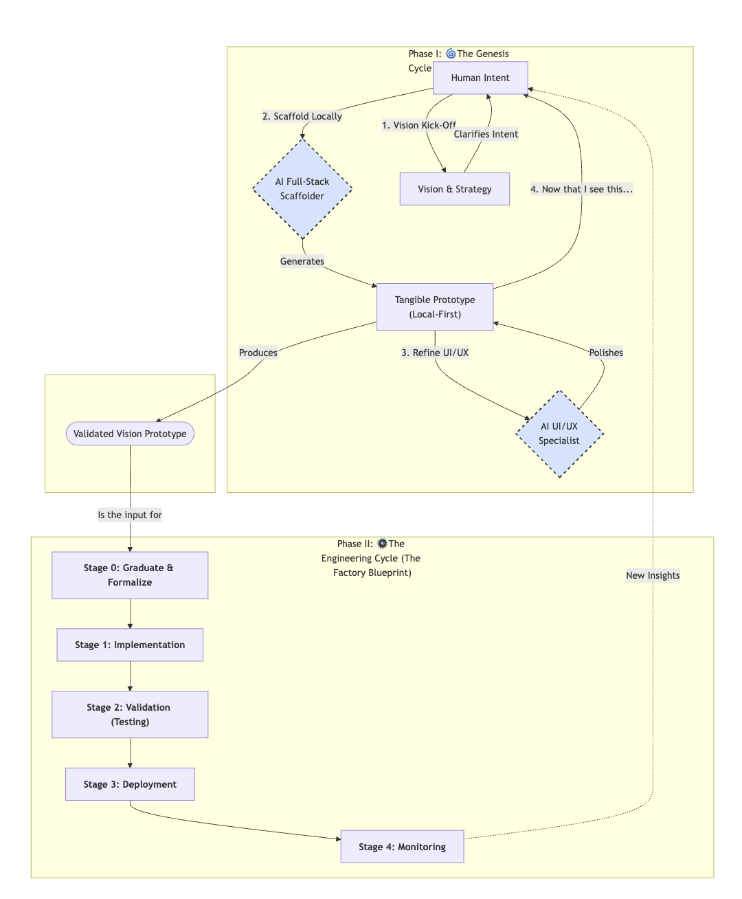

# The Quantum Diamond AI Application Development Framework
**Version:** 4.2

## Overview
Traditional development models are breaking under the creative and technical pressures of the AI age. Teams are caught in a false dichotomy: move fast with inspired "vibe coding" and risk building brittle, unmaintainable systems, or move slowly with rigorous "architecture-first" discipline and risk engineering the wrong solution perfectly.

**The Quantum Diamond Framework is the synthesis that resolves this conflict.** It is a next-generation workflow designed for a world of collaborative AI that combines the speed of **AI-Powered Prototyping** with the empathy of **Service Design** and the rigor of **Architecture-First Engineering**.

## The Framework at a Glance

## Core Principles: Human Intent, AI Velocity, Engineering Rigor

1.  **Human-Led Vision:** The human is the strategist, the empath, the curator, and the final decision-maker.
2.  **AI-Powered Velocity:** We treat AI not as a tool, but as a team of specialist agents (a Full-Stack Scaffolder, a UI/UX Specialist, etc.) to accelerate discovery and prototyping.
3.  **Disciplined Engineering:** Creativity is channeled into structure. A validated vision is translated into a reliable, secure, and maintainable system.

## The Two Cycles of the Quantum Diamond Framework

The workflow consists of two distinct cycles. The first is a fluid, creative loop for envisioning the right solution. The second is a structured, predictable path to build that solution right. The transition between them is a deliberate, human-led decision.

`[ 🌀 The Genesis Cycle: Envision the Right Thing ] -> [ ⚙️ The Engineering Cycle: Build the Thing Right ]`

---
### Phase I: 🌀 The Genesis Cycle (The Jam Session)

**Goal:** To explore possibilities and collapse them into a single, validated vision. This phase is a **dynamic, non-linear jam session** that prioritizes a **local-first prototyping** approach. We use lightweight, local tools (like SQLite) to make ideas tangible instantly, allowing professional engineering artifacts to emerge organically without the friction of cloud setup.

➡️ **For a detailed guide, see the [Playbook: The Genesis Cycle](./01_playbook-genesis-cycle.md).**

---
### Phase II: ⚙️ The Engineering Cycle (Build the Thing Right)

**Goal:** To take the validated vision—the collapsed reality—and build it with discipline. This phase begins when the Human Lead initiates the "collapse" by transitioning the AI to a production-focused mindset. It then proceeds with deterministic execution where architectural rigor, tests, and schemas are paramount.

➡️ **For a detailed, step-by-step guide, see the [Playbook: The Engineering Cycle](./02_playbook-engineering-cycle.md).**

---

## How to Use This Repository

This repository contains the complete methodology and practical guides for the Quantum Diamond Framework.

*   **`README.md`**: (This file) The high-level overview, core principles, and visual diagram of the entire process. **Start here.**
*   **`01_playbook-genesis-cycle.md`**: A tactical guide explaining the actors, principles, and local-first flow of the creative "jam session".
*   **`02_playbook-engineering-cycle.md`**: A tactical guide for architects and engineers, including how to graduate a prototype to production.
*   **`03_walkthrough-genesis-cycle-in-action.md`**: A detailed, step-by-step example of the Genesis Cycle, showing exact prompts for building a real-world application with a local-first approach.
*   **`prompts/04_AIA_SYSTEM_PROMPT.md`**: The core system prompt to initialize an AI assistant for the **Genesis Cycle**, turning it into your creative prototyping partner.
*   **`prompts/05_ENGINEERING_KICKOFF_PROMPT.md`**: The critical transition prompt used to shift the AI from a creative prototyper to a disciplined production engineer, officially starting the **Engineering Cycle**.
*   **`HowToUseToBuildAnApp.md`**: A hands-on tutorial that walks you through using the framework and both core prompts to build a sample application from scratch. **Read this to get started.**