# Quantum Diamond Framework

[](#agent-hygiene)

A practical framework to go from **idea → prototype → production engineering** for apps and agents.

## TL;DR (5-minute start)
- **Build an app:** open `PROMPTS/App-Authoring-Architect.md` in your IDE chat and follow "Vision → Scaffold".
- **Build an agent:** open `PROMPTS/Agent-Authoring-Guardian.md` and follow **Phase 0: Secure Setup**.
- **Harden to prod:** follow `02_playbook-engineering-cycle.md`.

## Hygiene & Anti-Patterns
- Run locally: `npm run hygiene:full`
- Latest CI report: see **Actions → Agent Hygiene** artifacts.
Traditional development models are breaking under the creative and technical pressures of the AI age. Teams are caught in a false dichotomy: move fast with inspired "vibe coding" and risk building brittle, unmaintainable systems, or move slowly with rigorous "architecture-first" discipline and risk engineering the wrong solution perfectly.

**The Quantum Diamond Framework is the synthesis that resolves this conflict.** It is a next-generation workflow designed for a world of collaborative AI that combines the speed of **AI-Powered Prototyping** with the empathy of **Service Design** and the rigor of **Architecture-First Engineering**.

For a detailed introduction to the philosophy behind this framework, see the [announcement article on Medium](https://medium.com/@rfremmer_30873/beyond-the-double-diamond-design-process-a-new-framework-for-the-ai-age-the-quantum-diamond-980fe3f89319).

## Why this repo exists
This repository captures a practical pathway from fast agent/app prototyping to production-grade engineering. It complements the article:

- *[The MCP Agent Revolution Has a Dirty Secret: Most Agents Are Built by People Who Don't Understand Software Engineering* (Medium)](https://medium.com/@rfremmer_30873/the-mcp-agent-revolution-has-a-dirty-secret-most-agents-are-built-by-people-who-dont-understand-940276372db2)

### From prototype to production (plain-language diagram)

```mermaid
flowchart TD
    A[Explore ideas] --> B[Try lots of possibilities]
    B --> C[Figure out what actually matters]
    C --> D[Focus and narrow things down]
    D -->|Quick feedback loop| A

    D -->|Handoff to professional engineers| F[Engineering takeover<br/>• Apply standards<br/>• Architect the system<br/>• Add guardrails & testing]
    F -->|Build it for real| E[Production-grade agent<br/>• Secure<br/>• Scalable<br/>• Efficient]
```


## What's new
Recent updates focus on **agent hygiene and engineering rigor** to prevent common pitfalls in AI agent development:

- **[Agent Anti-Patterns](./docs/agent-anti-patterns.md)**: 8 common pitfalls with fixes (context bloat, PII leaks, inefficient control flow)
- **[Handoff Checklists](./docs/checklists/agent_handoff_checklist.md)**: Operational checklists for prototype→engineering transition
- **[Agent Hygiene Scaffolds](./templates/agent_hygiene/)**: Reusable code patterns for secure, efficient agent development
- **Enhanced Diagrams**: Visual workflows for both app and agent development with explicit handoff points

## Start here
- [How to Start Your Project](./HowToStartYourProject.md) - Initialize AI partners for apps or agents
- [Genesis Cycle](./01_playbook-genesis-cycle.md) - Creative prototyping phase
- [Engineering Cycle](./02_playbook-engineering-cycle.md) - Production hardening phase
- [Agent Authoring Workflow](./08_playbook-agent-authoring-workflow.md) - Secure agent development
- [Agent Anti-Patterns](./docs/agent-anti-patterns.md) - Common pitfalls and fixes
- [Agent Handoff Checklist](./docs/checklists/agent_handoff_checklist.md) - Prototype to production transition
- [Agent Hygiene Inspector](./PROMPTS/Agent-Hygiene-Inspector.md) - Anti-pattern audit specialist

## Quantum Diamond Roles Overview

```mermaid
graph LR

A([Human Lead<br/>🧑‍💼]):::role --> B([Guardian Persona<br/>🛡️]):::role
A --> C([App Architect<br/>📐]):::role
A --> D([Agent Architect<br/>🧠]):::role

B --> E([Secure Setup<br/>Safe Sandbox]):::phase
C --> F([Genesis Cycle<br/>Prototype Creation]):::phase
D --> G([Agent Prototyping Loop]):::phase

F --> H([Engineering Cycle<br/>Production Build]):::phase
G --> H

H --> I([Handoff to Professional Engineers<br/>🏭]):::handoff

classDef role fill:#dbeafe,stroke:#1e40af,stroke-width:1px,color:#000;
classDef phase fill:#fef9c3,stroke:#a16207,stroke-width:1px,color:#000;
classDef handoff fill:#dcfce7,stroke:#166534,stroke-width:1px,color:#000;
```



## Roles & Handoffs (Agent Path)

```mermaid
flowchart LR
  subgraph Ideate["Citizen Dev — Jam Session"]
    A[Explore] --> B[Diverge]
    B --> C[Define]
    C --> D[Converge]
  end

  D -- "Handoff (pre-vetted snapshot, checklists passed)" --> E[[Pro Engineers]]

  E --> F[Engineer for Production]
  F --> G[(Production-Grade Agent)]
  click E href "02_playbook-engineering-cycle.md" "Engineering Cycle"
```



## Quantum Diamond Specialist Roles

This framework uses three internal specialists that work together during the
Genesis Cycle and Engineering Cycle. Each has a narrow, well-defined mandate.

### ✅ Governance Guardian
Ensures:
- documentation consistency
- requirements traceability
- ADR alignment
- process correctness
- governance integrity

### ✅ Specialist Agent Architect
Ensures:
- correct system architecture
- proper agent/tool patterns
- scalable execution layers
- JIT tool loading
- stateful engineering

### ✅ Agent Hygiene Inspector (NEW)
Ensures:
- no context bloat
- no duplicated tools
- no raw large data through the model
- safe PII handling
- proper data filtering
- efficient control flow (loops in code, not LLM)
- persistent state
- anti-pattern prevention

### Three Specialist Workflow

```mermaid
flowchart LR

    A[Genesis Cycle<br/>Citizen Dev Exploration] --> B[Prototype]

    B -->|Handoff| GG[Governance Guardian<br/>Process & Documentation Integrity]
    B -->|Handoff| HA[Agent Hygiene Inspector<br/>Efficiency · Safety · Anti-Patterns]
    B -->|Handoff| SA[Specialist Agent Architect<br/>Architecture · Tools · State]

    GG --> E[Engineering Cycle]
    HA --> E
    SA --> E

    E --> P[Production-Grade Agent<br/>Secure · Scalable · Efficient]
```



## Agent Hygiene Inspector Pipeline

The Agent Hygiene Inspector is an automated quality assurance system that scans your codebase for common AI agent development anti-patterns and hygiene violations.

### Purpose
- **Detects 8+ major anti-patterns** before they cause production issues
- **Enforces engineering hygiene** for scalable, secure agent development
- **Provides automated code review** for agent-specific concerns
- **Generates structured reports** for development teams

### Where Inspectors Live
Hygiene inspectors are located in `templates/agent_hygiene/`:
- `controlFlow.ts` - Control flow and loop management
- `dataPlane.ts` - Data handling and storage patterns
- `privacy.ts` - PII and secrets management
- `toolRegistry.ts` - Tool loading and registry patterns
- `controlPlane.ts` - Prompt engineering and state management

### How to Run It
1. Generate a project snapshot: `node capture_code_snapshot.js`
2. Inspectors run automatically after snapshot generation
3. Review the report at `docs/agent_hygiene_report.md`

### Sample Output
```markdown
# Agent Hygiene Report
Generated: 2025-11-07T10:30:00.000Z

## Findings Overview
- Total Findings: 3
- Errors: 1
- Warnings: 2

## Inspectors Run
- controlFlow
- dataPlane
- privacy
- toolRegistry
- controlPlane

## Detailed Findings

### controlPlane
- [ERROR] Anti-pattern: Embedding entire schemas in prompts
- [WARN] Context-stuffing tendency detected
```

## Mermaid Diagrams

### Quantum Loop (Creative Discovery → Engineering Handoff)

```mermaid
flowchart TD
    A[Explore]:::n --> B[Open Up Options]:::n
    B --> C[Define What Matters]:::n
    C --> D[Focus & Commit]:::n

    D -- "Rapid iteration loop\n(back to discovery)" --> A

    D --> E[Engineered System\n— Guardrails • Tests • Architecture]:::e
classDef n fill:#f3f4f6,stroke:#9ca3af,color:#111827;
classDef e fill:#dcfce7,stroke:#16a34a,color:#065f46;
```


### Agent Workflow with Professional Handoff

```mermaid
graph LR
    subgraph S0["Phase 0 • Secure Setup"]
      G["Guardian Init\nPII & Secrets Rules · Pre-commit Scans · ADR stubs"]
    end
    subgraph S1["Phase 1 • Guided Prototyping"]
      L["Creative Loop\nExplore → Try → Narrow → Validate"]
    end
    subgraph S2["Phase 2 • Professional Engineering"]
      E["Engineering Takeover\nHarden • Scale • Tests"]
      P["Production-Grade Agent\nSecure · Scalable · Efficient"]
      E --> P
    end

    G --> L
    L -- "Pre-vetted handoff\n→ Pro Engineers" --> E
```


## The Framework at a Glance


## Core Principles: Human Intent, AI Velocity, Engineering Rigor

1.  **Human-Led Vision:** The human is the strategist, the empath, the curator, and the final decision-maker.
2.  **AI-Powered Velocity:** We treat AI not as a tool, but as a specialist partner to accelerate discovery and prototyping.
3.  **Disciplined Engineering:** Creativity is channeled into structure. A validated vision is translated into a reliable, secure, and maintainable system.

---

## Specialization for AI Application Authoring

The Quantum Diamond Framework excels at building modern web applications through structured collaboration between human vision and AI specialization. The framework provides dedicated AI partners for different aspects of application development, ensuring comprehensive coverage from initial concept to production deployment.

This approach combines the creative freedom of rapid prototyping with the discipline of iterative expert analysis, using specialized AI agents to refine and optimize every aspect of your application.


This structured process ensures applications are built with modern best practices, refined through expert analysis, and delivered as production-ready systems.

➡️ **[See the full Application Authoring Workflow here](./HowToUseToBuildAnApp.md)**

---

## Specialization for AI Agent Authoring

While the Quantum Diamond Framework applies broadly, building autonomous **AI Agents** requires an even greater emphasis on security and architectural rigor from the start. To address this, the framework includes a specialized workflow that introduces a critical **"Phase 0: Secure Setup."**

This "shift-left" approach to security establishes a guarded sandbox *before* prototyping begins, preventing common pitfalls like data leaks and inefficient design.

```mermaid
graph TD
    %% Phase 0: The Secure Setup
    subgraph Phase0 ["Phase 0: The Secure Setup"]
        style Phase0 fill:#f3f4f6,stroke:#4b5563,color:#111827
        Setup["<strong>The Guardian Agent / Initial Prompt</strong><br/><br/>✔ Generates secure agent boilerplate<br/>✔ Establishes PII & secrets rules<br/>✔ Sets up pre-commit hooks & scans<br/>✔ Creates initial ADRs"]
    end

    %% Phase 1: Guided Prototyping
    subgraph Phase1 ["Phase 1: Guided Prototyping"]
        style Phase1 fill:#fffbeb,stroke:#a16207,color:#111827
        Loop["<strong>The Creative Loop</strong><br/><br/>Explore Ideas →<br/>Try Possibilities (Divergence) →<br/>Figure out what matters (Convergence) →<br/>Focus & Narrow Down"]
        
        NOTE1["<strong>Annotation:</strong><br/>Creative freedom within safe boundaries.<br/>Speed is the goal; safety is a given."]
        
        Loop ~~~ NOTE1;
    end

    %% Phase 2: Professional Engineering Build
    subgraph Phase2 ["Phase 2: Professional Engineering Build"]
        style Phase2 fill:#f0f9ff,stroke:#0c4a6e,color:#111827
        E["<strong>Engineering Takeover</strong><br/>• Harden architecture<br/>• Optimize for scale<br/>• Add comprehensive testing"];
        F["<strong>Production-Grade Agent</strong><br/>• Secure by Design<br/>• Scalable<br/>• Efficient"];
        E -- "Build it for real" --> F;
    end

    %% --- Connections Between Phases ---
    Setup -- "Creates Guarded Sandbox" --> Loop;
    Loop -- "The <strong>Pre-Vetted</strong> Handoff" --> E;

    %% --- Node Styles ---
    style Setup fill:#e5e7eb,stroke:#374151
    style Loop fill:#f3e8ff,stroke:#7e22ce
    style E fill:#dbeafe,stroke:#1e40af
    style F fill:#dcfce7,stroke:#166534
    style NOTE1 fill:#f1f5f9,stroke:#64748b,color:#111827
```



This specialized process ensures that agents are built on a foundation of security and sound engineering from the very first step.

➡️ **[See the full Agent Authoring Workflow here](./08_playbook-agent-authoring-workflow.md)**

---

## Getting Started: A Two-Step Guide

The Quantum Diamond Framework is a complete system for both starting new projects and continuously improving them.

### Step 1: Start Your Project (App or Agent)
Begin by choosing your development path and initializing an AI partner with a specialized "Orchestrator" prompt. This first phase will guide you from a simple idea to a fully scaffolded prototype.

➡️ **To begin, follow the guide: [How to Start Your Quantum Diamond Project](./HowToStartYourProject.md)**

### Step 2: Iterate and Improve with Specialists
Once you have a prototype, you can enter the powerful "inner loop" of the framework. Use specialist AI agents to analyze your codebase, recommend improvements, and provide expert refactoring guidance.

➡️ **To refine your project, follow the guide: [How to Iterate and Improve with Specialist Agents](./HowToIterateAndImprove.md)**

---

## How to Use This Repository

This repository contains the complete methodology and practical guides for the Quantum Diamond Framework.

*   **`README.md`**: (This file) The high-level overview and practical getting started guide. **Start here.**
*   **Playbooks (`01_` to `07_`)**: A series of detailed guides explaining the framework's phases, from the creative "Genesis Cycle" to the rigorous "Engineering Cycle" and project scaffolding.
*   **`prompts/`**: The core system prompts used to initialize your AI partner.
*   **`templates/`**: Reusable markdown templates for Requirements and Tasks to enforce the engineering workflow.
*   **`HowToStartYourProject.md`**: Your first step. A guide to initializing your AI partner and creating your first prototype for either a web app or an agent.
*   **`HowToIterateAndImprove.md`**: The "inner loop" guide. How to use specialist agents and your codebase snapshot to continuously refactor and improve your project.

### How this repo is organized

**Playbooks:** `01_playbook-genesis-cycle.md`, `02_playbook-engineering-cycle.md`, `06_playbook-workflow-in-practice.md`

**Agent Authoring:** `08_playbook-agent-authoring-workflow.md`, `docs/agent-anti-patterns.md`, `docs/checklists/agent_handoff_checklist.md`

**Prompts:** `PROMPTS/Governance-Guardian.md`, `PROMPTS/Specialist-Agent-Architect.md`, `PROMPTS/Agent-Hygiene-Inspector.md`
(all present in snapshot)

### Hygiene Inspector Structure

```
templates/
agent_hygiene/
controlFlow.ts
dataPlane.ts
privacy.ts
toolRegistry.ts
controlPlane.ts
docs/
agent_hygiene_report.md
```

## Governance & Traceability
- `06_playbook-workflow-in-practice.md` (traceable workflow)
- `PROMPTS/Governance-Guardian.md` (how to audit)
- `templates/TEMPLATE_REQUIREMENT.md` & `templates/TEMPLATE_TASK.md`

### Start here
- [Genesis Cycle](./01_playbook-genesis-cycle.md)
- [Engineering Cycle](./02_playbook-engineering-cycle.md)
- [Agent Authoring Workflow](./08_playbook-agent-authoring-workflow.md)
- [Agent Anti-Patterns](./docs/agent-anti-patterns.md)
- [Handoff Checklist](./docs/checklists/agent_handoff_checklist.md)

---

## License

The Quantum Diamond AI Application Development Framework is open-source and available under the [MIT License](./LICENSE). You are free to use, modify, and distribute it, but please provide attribution to the original creator, Richard Fremmer.
