# The Quantum Diamond AI Application Development Framework
**Version:** v18

## Overview
Traditional development models are breaking under the creative and technical pressures of the AI age. Teams are caught in a false dichotomy: move fast with inspired "vibe coding" and risk building brittle, unmaintainable systems, or move slowly with rigorous "architecture-first" discipline and risk engineering the wrong solution perfectly.

**The Quantum Diamond Framework is the synthesis that resolves this conflict.** It is a next-generation workflow designed for a world of collaborative AI that combines the speed of **AI-Powered Prototyping** with the empathy of **Service Design** and the rigor of **Architecture-First Engineering**.

For a detailed introduction to the philosophy behind this framework, see the [announcement article on Medium](https://medium.com/@rfremmer_30873/beyond-the-double-diamond-design-process-a-new-framework-for-the-ai-age-the-quantum-diamond-980fe3f89319).

## The Framework at a Glance

```mermaid
graph TD
    subgraph "Phase I: 🌀 The Genesis Cycle (The Jam Session)"
        A[Human Intent]
        B{AI Full-Stack<br/>Scaffolder}
        C["Tangible Prototype<br/>(Local-First)"]
        D{AI UI/UX<br/>Specialist}
        E[Vision & Strategy]

        A -- "1. Vision Kick-Off" --> E
        E -- "Clarifies Intent" --> A
        A -- "2. Scaffold Locally" --> B
        B -- "Generates" --> C
        C -- "3. Refine UI/UX" --> D
        D -- "Polishes" --> C
        C -- "4. Now that I see this..." --> A
    end
    
    subgraph " "
        ValidatedVision(["Validated Vision Prototype"])
        C -- "Produces" --> ValidatedVision
    end

    subgraph "Phase II: ⚙️ The Engineering Cycle (The Factory Blueprint)"
        S0[<b>Stage 0: Graduate & Formalize</b>]
        S1[<b>Stage 1: Implementation</b>]
        S2["<b>Stage 2: Validation (Testing)</b>"]
        S3[<b>Stage 3: Deployment</b>]
        S4[<b>Stage 4: Monitoring</b>]
        
        S0 --> S1 --> S2 --> S3 --> S4
    end

    ValidatedVision -- "Is the input for" --> S0
    S4 -.-> |New Insights| A

    %% Styling
    style B fill:#d4e4ff,stroke:#333,stroke-width:2px,stroke-dasharray: 5 5
    style D fill:#d4e4ff,stroke:#333,stroke-width:2px,stroke-dasharray: 5 5
```

## Core Principles: Human Intent, AI Velocity, Engineering Rigor

1.  **Human-Led Vision:** The human is the strategist, the empath, the curator, and the final decision-maker.
2.  **AI-Powered Velocity:** We treat AI not as a tool, but as a specialist partner to accelerate discovery and prototyping.
3.  **Disciplined Engineering:** Creativity is channeled into structure. A validated vision is translated into a reliable, secure, and maintainable system.

---

## Specialization for AI Agent Authoring

While the Quantum Diamond Framework applies broadly, building autonomous **AI Agents** requires an even greater emphasis on security and architectural rigor from the start. To address this, the framework includes a specialized workflow that introduces a critical **"Phase 0: Secure Setup."**

This "shift-left" approach to security establishes a guarded sandbox *before* prototyping begins, preventing common pitfalls like data leaks and inefficient design.

```mermaid
graph LR
    %% Phase 0: The Secure Setup (Left)
    subgraph Phase0 ["Phase 0: Secure Setup"]
        style Phase0 fill:#f3f4f6,stroke:#4b5563,color:#111827
        Setup["<strong>Guardian Agent / Initial Prompt</strong><br/>✔ Generates secure boilerplate<br/>✔ Establishes PII & secrets rules<br/>✔ Sets up pre-commit hooks"]
    end

    %% Phase 1: Guided Prototyping (Middle)
    subgraph Phase1 ["Phase 1: Guided Prototyping"]
        style Phase1 fill:#fffbeb,stroke:#a16207,color:#111827
        Loop["<strong>The Creative Loop</strong><br/>(Diverge & Converge)"]
    end

    %% Phase 2: Professional Engineering (Right)
    subgraph Phase2 ["Phase 2: Engineering Build"]
        style Phase2 fill:#f0f9ff,stroke:#0c4a6e,color:#111827
        E["<strong>Engineering Takeover</strong><br/>• Harden & optimize<br/>• Add testing"]
    end

    %% --- Connections ---
    Setup -- "Creates Guarded Sandbox" --> Loop;
    Loop -- "The <strong>Pre-Vetted</strong> Handoff" --> E;
```

This specialized process ensures that agents are built on a foundation of security and sound engineering from the very first step.

➡️ **[See the full Agent Authoring Workflow here](./08_playbook-agent-authoring-workflow.md)**

---

## Putting it into Practice: Your First Project

The Quantum Diamond Framework provides specialized "Guardian" prompts to initialize your AI partner for your specific goal.

### Step 1: Choose Your Path and Initialize Your AI Partner

This is the most critical step. You begin not by writing code, but by "training" your AI assistant for the task at hand.

-   **To Build a Full-Stack Web Application:**
    -   **Action:** In a new project folder, start a conversation with your AI assistant and provide it with the entire contents of `PROMPTS/App-Authoring-Architect.md`.
    -   **Outcome:** Your AI is now the **Quantum Diamond App Architect**, ready to build a web app.

-   **To Build an AI Agent:**
    -   **Action:** In a new project folder, start a conversation with your AI assistant and provide it with the entire contents of `PROMPTS/Agent-Authoring-Guardian.md`.
    -   **Outcome:** Your AI is now the **Quantum Diamond Agent Guardian**, ready to build a secure agent.

### Step 2: Share Your Vision and Follow the Guided Dialogue

Once your AI partner is initialized, simply engage it in a natural language conversation. For example: *"Let's build an app to track my workouts."*

The AI will then initiate its specialized protocol (either the App Architect's vision-first dialogue or the Agent Guardian's secure-setup process), guiding you through the rest of the Genesis Cycle.

For a detailed walkthrough, see the tutorial: **[How to Use This Framework to Build Your App](./HowToUseToBuildAnApp.md)**.

## Iterating and Improving with Specialist Agents

Once your project is underway, the Quantum Diamond Framework provides **Specialist Agents** for expert analysis and iterative improvement.

### When to Use Specialist Agents

After completing initial scaffolding or when you need expert guidance on specific aspects:

-   **App Scaffolding Review:** Use `PROMPTS/Specialist-App-Scaffolder.md` to analyze and improve your app's architecture and code structure.
-   **UI/UX Enhancement:** Use `PROMPTS/Specialist-App-UIUX.md` for design system and user experience improvements.
-   **Agent Architecture Analysis:** Use `PROMPTS/Specialist-Agent-Architect.md` to review and optimize AI agent implementations.
-   **Governance and Security:** Use `PROMPTS/Governance-Guardian.md` for compliance, security audits, and best practices validation.

### How to Engage Specialist Agents

1. **Initialize the Specialist:** In your project conversation, provide the entire contents of the relevant specialist prompt file.
2. **Share Your Codebase:** Provide a snapshot of your current code (use `capture_code_snapshot.js` to generate one).
3. **Ask for Analysis:** Request specific improvements or ask "What can be improved in this codebase?"

The specialists will provide expert recommendations tailored to their domain, helping you iterate and refine your project.

---

## How to Use This Repository

This repository contains the complete methodology and practical guides for the Quantum Diamond Framework.

*   **`README.md`**: (This file) The high-level overview and practical getting started guide. **Start here.**
*   **Playbooks (`01_` to `07_`)**: A series of detailed guides explaining the framework's phases, from the creative "Genesis Cycle" to the rigorous "Engineering Cycle" and project scaffolding.
*   **`prompts/`**: The core system prompts used to initialize your AI partner.
*   **`templates/`**: Reusable markdown templates for Requirements and Tasks to enforce the engineering workflow.
*   **`HowToUseToBuildAnApp.md`**: A hands-on tutorial for building an app from scratch.
