# The Quantum Diamond AI Application Development Framework
**Version:** v19

## Overview
Traditional development models are breaking under the creative and technical pressures of the AI age. Teams are caught in a false dichotomy: move fast with inspired "vibe coding" and risk building brittle, unmaintainable systems, or move slowly with rigorous "architecture-first" discipline and risk engineering the wrong solution perfectly.

**The Quantum Diamond Framework is the synthesis that resolves this conflict.** It is a next-generation workflow designed for a world of collaborative AI that combines the speed of **AI-Powered Prototyping** with the empathy of **Service Design** and the rigor of **Architecture-First Engineering**.

For a detailed introduction to the philosophy behind this framework, see the [announcement article on Medium](https://medium.com/@rfremmer_30873/beyond-the-double-diamond-design-process-a-new-framework-for-the-ai-age-the-quantum-diamond-980fe3f89319).

## The Framework at a Glance

## Core Principles: Human Intent, AI Velocity, Engineering Rigor

1.  **Human-Led Vision:** The human is the strategist, the empath, the curator, and the final decision-maker.
2.  **AI-Powered Velocity:** We treat AI not as a tool, but as a specialist partner to accelerate discovery and prototyping.
3.  **Disciplined Engineering:** Creativity is channeled into structure. A validated vision is translated into a reliable, secure, and maintainable system.

---

## Specialization for AI Application Authoring

The Quantum Diamond Framework excels at building modern web applications through structured collaboration between human vision and AI specialization. The framework provides dedicated AI partners for different aspects of application development, ensuring comprehensive coverage from initial concept to production deployment.

This approach combines the creative freedom of rapid prototyping with the discipline of iterative expert analysis, using specialized AI agents to refine and optimize every aspect of your application.

This structured process ensures applications are built with modern best practices, refined through expert analysis, and delivered as production-ready systems.

➡️ **[See the full Application Authoring Workflow here](./HowToUseToBuildAnApp.md)**

---

## Specialization for AI Agent Authoring

While the Quantum Diamond Framework applies broadly, building autonomous **AI Agents** requires an even greater emphasis on security and architectural rigor from the start. To address this, the framework includes a specialized workflow that introduces a critical **"Phase 0: Secure Setup."**

This "shift-left" approach to security establishes a guarded sandbox *before* prototyping begins, preventing common pitfalls like data leaks and inefficient design.

```mermaid
graph TD
    %% Phase 0: The Secure Setup
    subgraph Phase0 ["Phase 0: The Secure Setup"]
        style Phase0 fill:#f3f4f6,stroke:#4b5563,color:#111827
        Setup["<strong>The Guardian Agent / Initial Prompt</strong><br/><br/>✔ Generates secure agent boilerplate<br/>✔ Establishes PII & secrets rules<br/>✔ Sets up pre-commit hooks & scans<br/>✔ Creates initial ADRs"]
    end

    %% Phase 1: Guided Prototyping
    subgraph Phase1 ["Phase 1: Guided Prototyping"]
        style Phase1 fill:#fffbeb,stroke:#a16207,color:#111827
        Loop["<strong>The Creative Loop</strong><br/><br/>Explore Ideas →<br/>Try Possibilities (Divergence) →<br/>Figure out what matters (Convergence) →<br/>Focus & Narrow Down"]
        
        NOTE1["<strong>Annotation:</strong><br/>Creative freedom within safe boundaries.<br/>Speed is the goal; safety is a given."]
        
        Loop ~~~ NOTE1;
    end

    %% Phase 2: Professional Engineering Build
    subgraph Phase2 ["Phase 2: Professional Engineering Build"]
        style Phase2 fill:#f0f9ff,stroke:#0c4a6e,color:#111827
        E["<strong>Engineering Takeover</strong><br/>• Harden architecture<br/>• Optimize for scale<br/>• Add comprehensive testing"];
        F["<strong>Production-Grade Agent</strong><br/>• Secure by Design<br/>• Scalable<br/>• Efficient"];
        E -- "Build it for real" --> F;
    end

    %% --- Connections Between Phases ---
    Setup -- "Creates Guarded Sandbox" --> Loop;
    Loop -- "The <strong>Pre-Vetted</strong> Handoff" --> E;

    %% --- Node Styles ---
    style Setup fill:#e5e7eb,stroke:#374151
    style Loop fill:#f3e8ff,stroke:#7e22ce
    style E fill:#dbeafe,stroke:#1e40af
    style F fill:#dcfce7,stroke:#166534
    style NOTE1 fill:#f1f5f9,stroke:#64748b,color:#111827
```

This specialized process ensures that agents are built on a foundation of security and sound engineering from the very first step.

➡️ **[See the full Agent Authoring Workflow here](./08_playbook-agent-authoring-workflow.md)**

---

## Getting Started: A Two-Step Guide

The Quantum Diamond Framework is a complete system for both starting new projects and continuously improving them.

### Step 1: Start Your Project (App or Agent)
Begin by choosing your development path and initializing an AI partner with a specialized "Orchestrator" prompt. This first phase will guide you from a simple idea to a fully scaffolded prototype.

➡️ **To begin, follow the guide: [How to Start Your Quantum Diamond Project](./HowToStartYourProject.md)**

### Step 2: Iterate and Improve with Specialists
Once you have a prototype, you can enter the powerful "inner loop" of the framework. Use specialist AI agents to analyze your codebase, recommend improvements, and provide expert refactoring guidance.

➡️ **To refine your project, follow the guide: [How to Iterate and Improve with Specialist Agents](./HowToIterateAndImprove.md)**

---

## How to Use This Repository

This repository contains the complete methodology and practical guides for the Quantum Diamond Framework.

*   **`README.md`**: (This file) The high-level overview and practical getting started guide. **Start here.**
*   **Playbooks (`01_` to `07_`)**: A series of detailed guides explaining the framework's phases, from the creative "Genesis Cycle" to the rigorous "Engineering Cycle" and project scaffolding.
*   **`prompts/`**: The core system prompts used to initialize your AI partner.
*   **`templates/`**: Reusable markdown templates for Requirements and Tasks to enforce the engineering workflow.
*   **`HowToStartYourProject.md`**: Your first step. A guide to initializing your AI partner and creating your first prototype for either a web app or an agent.
*   **`HowToIterateAndImprove.md`**: The "inner loop" guide. How to use specialist agents and your codebase snapshot to continuously refactor and improve your project.

---

## License

The Quantum Diamond AI Application Development Framework is open-source and available under the [MIT License](./LICENSE). You are free to use, modify, and distribute it, but please provide attribution to the original creator, Richard Fremmer.
