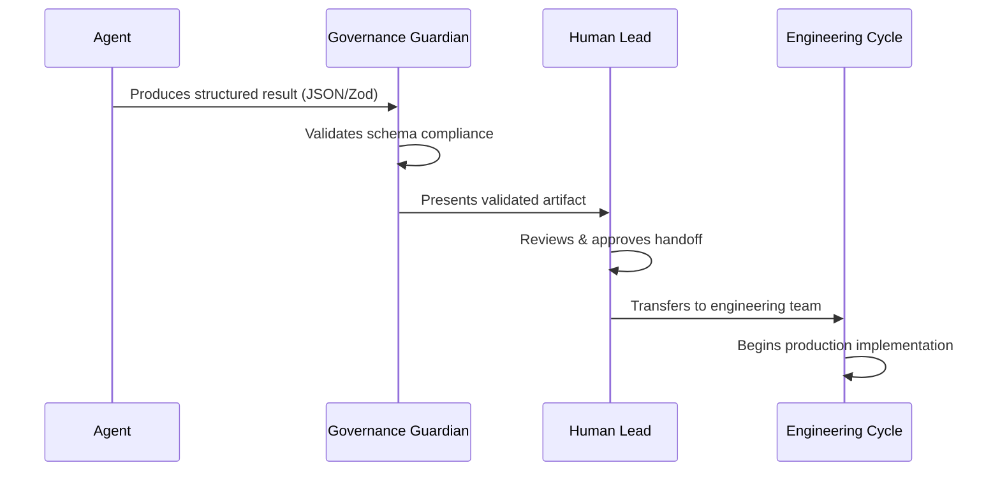

# Agent Handoff Checklist (Prototype → Engineering)

## Governance & Safety
- [ ] PII/secret handling: redaction/tokenization hooks enabled
- [ ] Tool permissions: least-privilege, audited

## Efficiency
- [ ] Tool schemas loaded JIT (no prompt stuffing)
- [ ] Large artifacts referenced by handle (no raw blobs to LLM)
- [ ] Data filtered/aggregated in code

## Architecture
- [ ] Shared tool registry/pkg in place (no duplication)
- [ ] Control flow in code (polling/loops); LLM for high-level intent
- [ ] State persisted (DB/files); caches; RAG/CAG if applicable

## Testing & Ops
- [ ] Contract tests for tool I/O (schemas)
- [ ] Guardrail tests (PII, length, cost, latency)
- [ ] CI wired; basic monitoring (cost/latency/validation failures)