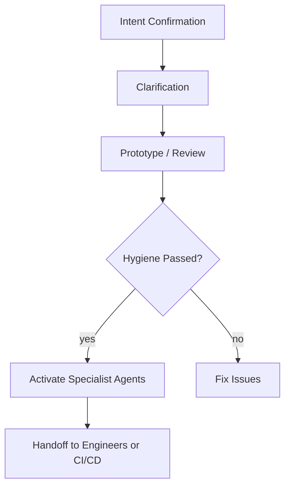

# How to Iterate and Improve with Specialist Agents
**Version:** v19

The Quantum Diamond Framework isn't just for starting projects; it's a powerful system for iteratively refining and improving your codebase with expert AI analysis. This is the "inner loop" of development.

This guide assumes you have an existing project created using the framework.

---

## The Three-Step Iteration Loop

Follow this process whenever you want to analyze your code, refactor a feature, or get expert advice on a specific domain like UI/UX or security.

### Step 1: Capture Your Codebase Snapshot
First, we need to provide the full context of your project to the specialist agent.
1.  Open your terminal and navigate to the root directory of your project.
2.  Run the command:
    ```bash
    node ./capture_code_snapshot.js
    ```
3.  This will create a new file in your root directory named `all_markdown_and_code_snapshot_llm_distilled.txt`. This file contains all the necessary context.
4.  **MANDATORY: Run hygiene inspection before consulting specialists:**
    ```bash
    npm run hygiene:full
    ```
5.  **Review both hygiene reports:**
    - `docs/agent_hygiene_report.md` (agent-specific issues)
    - `docs/app_hygiene_report.md` (app-specific issues)
6.  **CRITICAL:** Do not proceed with specialist consultation if hygiene errors exist. Fix all ERROR severity findings first.

### Hygiene Requirements for Specialist Consultation

**🚫 BLOCKERS (Must Fix First):**
- Any ERROR severity findings in `docs/agent_hygiene_report.md` **or** `docs/app_hygiene_report.md`
- Missing either hygiene report (inspection not run)
- Critical privacy violations detected
- Schema embedding anti-patterns

**⚠️ WARNINGS (Address Soon):**
- Context stuffing tendencies
- State persistence issues
- Data filtering gaps
- Dependency vulnerabilities
- Missing test coverage

**✅ SAFE TO PROCEED:**
- Both hygiene reports exist and show 0 errors
- Only warnings present (optional to fix before consultation)
- All inspectors have run successfully

### Step 2: Choose Your Specialist
Select a specialist prompt from the `PROMPTS/` directory that matches your goal. Each specialist is an expert in a specific domain.

*   **For Application Architecture:** Use `PROMPTS/Specialist-App-Scaffolder.md` to review your overall project structure, server logic, and database schema.
*   **For Application UI/UX:** Use `PROMPTS/Specialist-App-UIUX.md` to get recommendations on component design, user experience, and visual consistency.
*   **For Agent Architecture:** Use `PROMPTS/Specialist-Agent-Architect.md` to audit your agent for anti-patterns like "Context Stuffing" or "Willful Amnesia."
*   **For Governance & Documentation:** Use `PROMPTS/Governance-Guardian.md` to check for traceability, missing documentation (ADRs, requirements), and adherence to the framework's process.

### Step 3: Engage the Specialist
1.  Start a **new chat session** with your AI assistant to ensure a clean context.
2.  **Step 0: Generator-Safe Boot**
    - Paste `templates/generator_safe/SystemModePrelude.md`
    - Paste `templates/generator_safe/PhaseMinus1_Minimal.md`
3.  Wait for intent confirmation → then paste the **entire content** of the specialist prompt you chose in Step 2.
4.  Immediately after, paste the **entire content** of the `all_markdown_and_code_snapshot_llm_distilled.txt` file you generated in Step 1.

**Result:** The specialist agent will provide a detailed analysis, a prioritized list of actionable recommendations, and often, the exact refactored code needed to implement the improvements.

**Important:** Never consult a Specialist until hygiene errors = 0. The hygiene inspection ensures your codebase follows best practices and anti-pattern prevention before receiving expert analysis.

### Hygiene Integration in Development Workflow

**Pre-Specialist Checklist:**
- [ ] Codebase snapshot generated
- [ ] Hygiene inspection run (`npm run hygiene:full`)
- [ ] Hygiene reports reviewed (`docs/agent_hygiene_report.md` and `docs/app_hygiene_report.md`)
- [ ] All ERROR findings resolved in both reports
- [ ] WARNING findings addressed (optional but recommended)

**Post-Specialist Actions:**
- [ ] Implement recommended changes
- [ ] Re-run hygiene inspection to verify fixes
- [ ] Update documentation if architectural changes made
- [ ] Commit changes with descriptive messages

You can repeat this loop as many times as needed to continuously harden and professionalize your application or agent.

## Quantum Diamond Workflow

